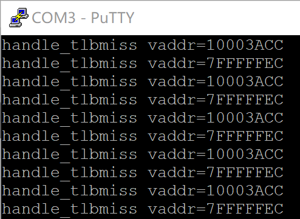
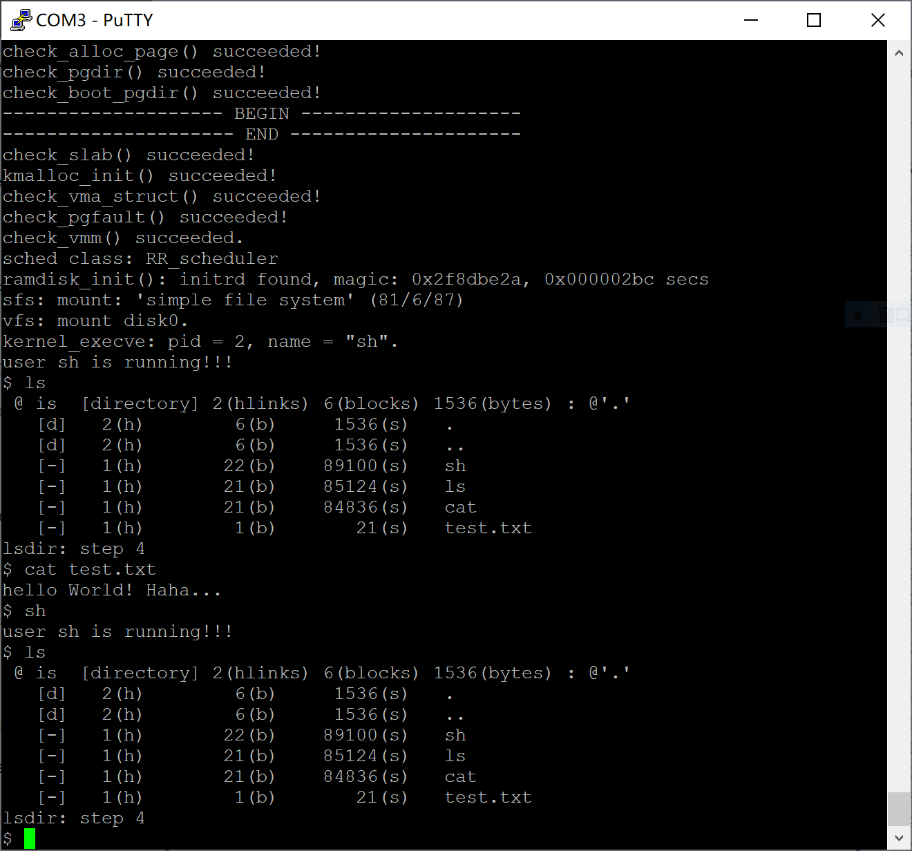

## 2020/12/29

配置好了编译/运行/调试所需要的各种环境。之前台式机只有WSL，笔记本才安装了Arch Linux，由于编译比较吃性能在台式机再配一遍环境。

包括在自己台式机上安装了Debian虚拟机，并配置好了zsh几个插件提高终端使用效率，安装了vscode、sublime text，从龙芯官网下载为ls232编写的编译器，并安装好了各种交叉编译编译的lib和gdb-multiarch。

在Vivado中综合了龙芯给的soc\_up代码，加入ls232 CPU部分，并上板，同时修改Linux内核编译参数显示调试信息，自己编译的Linux启动成功，测试通过。

## 2020/12/30

1. 将队友写的ls232在Vivado中进行替换，并针对一些有问题的信号命名进行了修改。综合成功，生成bit流成功，上板运行PMON成功，载入Linux内核在`Initrd not found or empty - disabling initrd`后卡着不动。
2. 尝试使用qemu-system-mipsel对照调试，发现串口打印上出了问题。
3. 晚上折腾时发现龙芯有提供ls232 CPU的qemu，于是拿来源码进行编译，处理了几个缺失的依赖后安装成功。
4. 定位到问题在于setup.c的arch_mem_init中，`bootmem_init`结束后，调用`sparse_init`函数中出了问题。
5. 继续调试发现问题出在调用`sparse_early_usemap_alloc`时，且第一次循环中调用已经出现问题。

## 2020/12/31

1. 由于对Linux内核进行一次Debug需要的时间太长了，打算先调通ucore。
2. 找到了清华的已经适应了ls232 CPU的ucore版本，然后下载下来，对Makefile进行修改处理了一些编译上的问题，commit到的自己的一个github仓库中。https://github.com/cyyself/ucore-thumips
3. 解决了ucore的MIPS版本调试的问题，从下午开始到晚上一直在解决ld一直没有.stab和.stabstr的问题，最后发现是ld的时候被加上了-S参数，查阅man发现该参数是用于去除调试信息的，去掉即可。
4. 学习了一点点MIPS处理器的分页方式

### 2021/1/1

1. 中午寝室聚餐喝了点酒，休息了一下午，傍晚又继续通过单步调试的方式研究了一下MIPS的内存管理过程，对MIPS架构上软件内存管理的方式有了更深的理解。
2. 与小组成员沟通，开始负责TLB的部分，并将内存分段的部分也放入TLB中。
3. 开始阅读龙芯LS232文档。

### 2021/1/2

1. 仔细阅读了小组成员去年暑假参加龙芯杯时写的TLB的代码，结合文档阅读代码发现虽然PageMask实现有问题，但是跑uCore页面大小为4KB不应该有问题。
2. 在QEMU中对同样的地方进行单步调试，发现写入CR0的BadVA在板子上写入的是指令的地址，而在QEMU上写入的是TLB找不到数据的地址，是由于异常处理部分写错，提醒了队友重构代码时注意该问题。
3. 完成了TLB重构中的TLB写入和TLB查找逻辑，还需要做一些异常处理。

### 2020/1/3

1. 对昨天写的TLB编写了testbench，查了几个错误之后TLBWI和TLBWR指令测试通过。

2. 看着文档添加了TLBP和TLBR指令。并对之前TLB写入的时候没有考虑的格式问题增加了处理。

3. 开始调试之前暑假龙芯杯参赛队伍的代码，发现在CP0寄存器写入异常信息的时候，对于excepttype_i=h00000012时，写入的badvaddr应为data_i，也就是数据的地址，而之前写成了指令的地址。在调整之后，uCore可以运行到载入进程处，而该处也是类似的问题。继续进行调整。

   

4. 修改了excepttype_i=h00000013时，写入的badvaddr应为data_i，现在uCore可以完成用户进程的载入过程，但是在用户程序处抛出了OV异常。经过gdb检查发现对应的指令是一个延迟槽，但后面存在一个ADDIU

   

   

5. 太晚了，睡觉，明天再调

### 2020/1/4

1. 与队友沟通，最后发现是Decode阶段的时候，对于ADDIU指令，传给ALU的控制信号与ADDI相同，而ADDIU是不会产生Overflow的。修改Verilog代码后，这条指令跑过了。

2. 上面修改代码之后，又产生了一个新的问题，TLB不断死循环处理两个地址。

   

   然后反编译了对应用户程序的代码，发现该处汇编如下：

   ```asm
   10003acc:  afbf001c   sw  ra,28(sp)
   ```

   显然，这里是由于，handle了指令tlbmiss后，数据又miss了，数据miss后指令又miss了。

   然后发现，CP0中的Random寄存器值一直没有修改，发现CP0寄存器实现逻辑有问题，因此这里考虑暂时放弃`TLBWR`指令，修改uCore代码，采用轮转的方式替换TLB index，这样只需要使用TLBWI指令即可。当然，事后还要修改Random寄存器的实现。

3. 成功运行uCore用户进程，但是串口中断存在问题导致无法输入指令。而连接串口中断后PMON都无法运行。询问队友后发现是int中断处理有问题，但int中断连上后PMON甚至无法载入。继续Debug。

   

4. 准备上板抓int信号，发现之前队友并没有接，接上之后调试得时候发现无法进入PMON，然后增加调试信号的时候发现int信号的最高位提示为GND。检查后发现LS232处理器的int只有[4:0]，修改后再次上板发现PMON无法载入，调试int信号一直为1，遂取反，于是PMON可以正常载入。结果上板发现uCore还是没有正确处理串口中断。

5. 最后修改uCore内核，加了几个kprintf进行调试，发现串口中断又被正确处理，只是键盘中断后没有去调度应用程序，最后才想起来时钟中断还没完成，于是通过修改uCore内核，每次键盘中断后顺便进行调度，终于以一种不完美的方式运行起了uCore内核。

   

6. 接下来要做的事情清单：

   1. 调节CP0的Random寄存器实现逻辑，使得`TLBWR`指令可用。
   2. 完成时钟中断