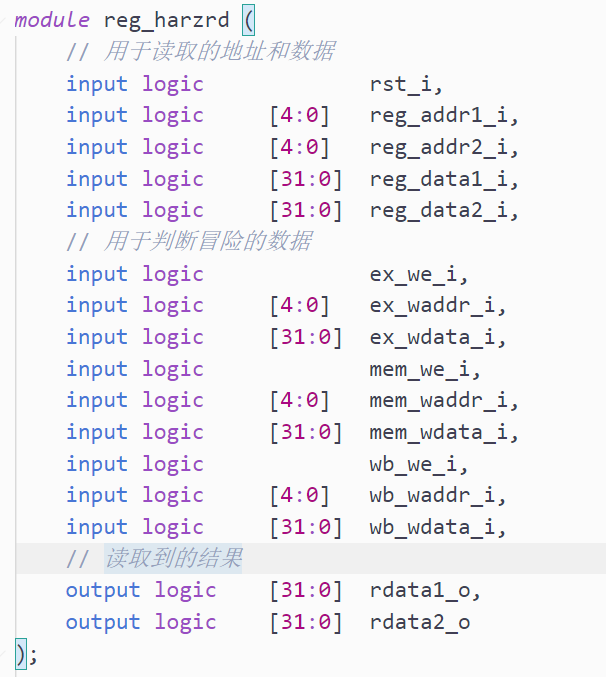
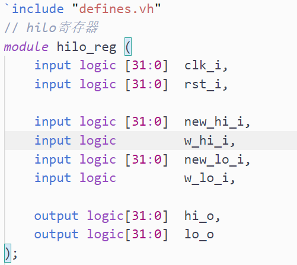
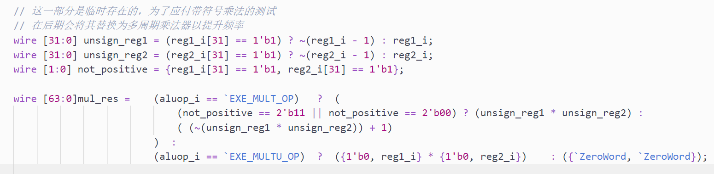
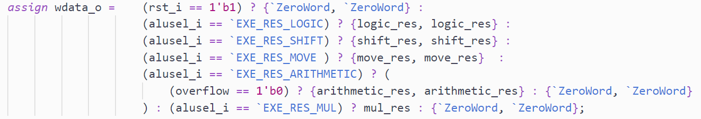
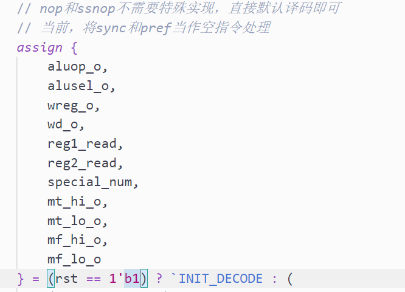

# Day2日志

今天完成了所有的逻辑指令、所有的移动指令以及大部分的算数指令，今天的日志主要来梳理一下，我添加了哪些模块，以及这些模块在全局中的位置，主要说一下以后可能成为雷的地方。

## 关于逻辑指令

逻辑指令部分利用了原有的数据通路，对译码器和运算器进行了修改，利用原有的写回通路进行操作。最重要的地方在于：

- 在ID阶段加入了模块`reg_harzrd`，用于寄存器取值的冒险，该阶段读取了ex、mem、wb阶段回写寄存器的信息，并且进行了冒险，冒险时，按照ex、mem、wb的顺序进行选择：

  

## 关于MOVE类型指令

在实现MOVE类型指令的过程中，在MEM阶段加入了HILO寄存器，端口定义如下：

有两个写入口和一个始终保持输出的hilo口组成。

hilo寄存器放在了MEM阶段，hilo寄存器的输出值直接被连接到了ALU上，在MFHI、MFLO两条指令时，ALU直接使用HILO寄存器中的值进行操作。

由于在EX阶段被使用、在MEM阶段被修改，所以不存在冒险行为。

## 关于算术指令

对于有符号数的乘法，当前阶段的做法是将其转化成无符号数后判断符号，在未来会使用多周期乘法器进行替代，以提升频率。

为了于HILO寄存器配合（乘法结果与触发结果），在这里，我将ALU的输出转化成了64位的，对于普通的操作而言，我将原本的符号复制了一份，组成了一个六十四位的信号：

## ID阶段

对于ID阶段，我添加了四个需要传递的状态：

表示当前对hilo寄存器可能进行的四种操作，这四个状态从ID阶段传出，实际上有些冗余，因为我们已经进行了译码，完全可以在EX阶段再通过ALUOP译出这些状态，但是问题不大（消耗不多），暂时先不修改。

