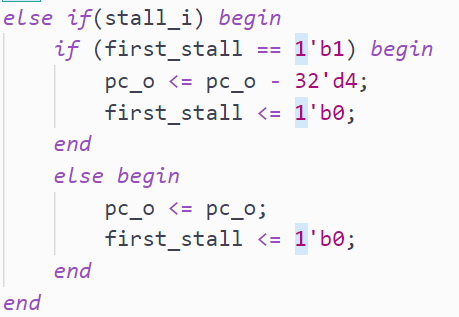
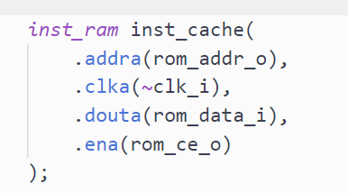
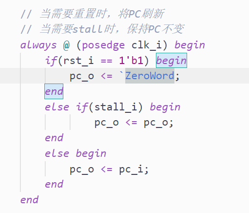
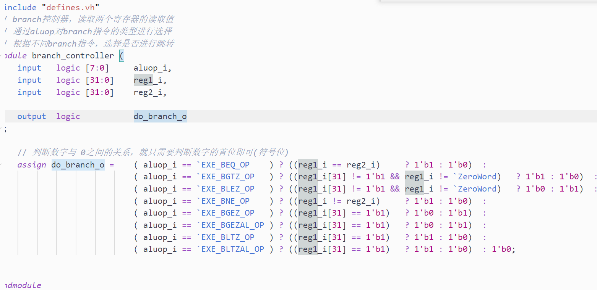

# Day3日志

## 对DIV的添加

DIV直接使用了原有代码中的DIV模块，由于现在还没有涉及到异常时的打断，所以暂时没有使用annual取消接口。

DIV添加过程中，最重要的是在DIV的过程中会对全局进行Stall，我将DIV的ready信号从alu接出，逐层传入了datapath，在datapath中传入了stall\_controller模块，该模块专门控制datapath中各个模块的stall行为，当前阶段，在且仅在DIV未完成时进行stall。

但是该特性导致了：IF阶段的下一跳指令无法被取出，这是因为：STALL时，将PCSTALL掉了，原本应该被拿去取指的PC被忽略，直接跳过。

我使用的解决方法是：在PC模块中，设计了一个first\_stall标识位，当被stall掉的第一个周期，`stall`标识被触发，这样可以保证stall前的pc和stall被释放时的pc不变：

## 对J的添加

这里添加了J指令，J指令就是跳转指令，主要涉及到利用原有器件进行取值、赋值这些简单操作。但是不幸的是：

- 时序产生了冲突：如果按照原有的时序，J之后的指令并没有被正确加载，这非常诡异，我暂时酶能找出错误
  - 解决方法：现在改为了时钟下降沿在指令寄存器中进行取指操作，这么做的代价是，上面DIV修改时添加的firstStall信号已经被删除，因为这样的话，stall后取指令的问题就被解决了：

## 对Branch指令的添加

与J类型指令大体上是相同的，重点是添加了一个判断是否需要跳转的模块，该模块直接添加到了id模块中：

